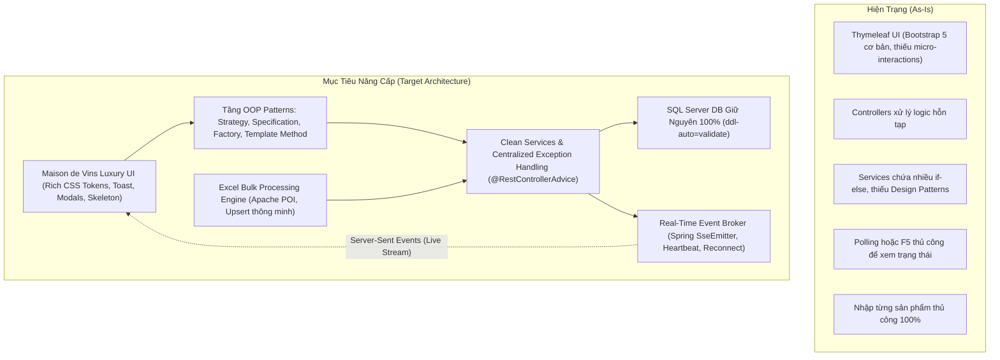
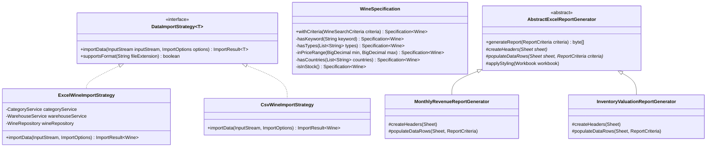
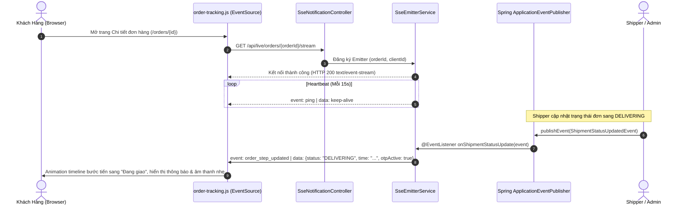
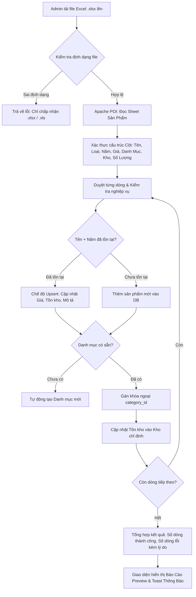

# Kiến Trúc Hệ Thống StrongWine (Architecture Blueprint)

> **Tài liệu đặc tả kiến trúc kỹ thuật toàn diện cho hệ thống thương mại điện tử & logistics rượu vang cao cấp StrongWine**  
> *Phiên bản: 2.0 (Modernized & Scalable Edition) — Áp dụng các nguyên tắc Clean Architecture, OOP Design Patterns, Real-time SSE kiểu Shopee/ShopeeFood, và Bảo toàn tuyệt đối Cơ sở dữ liệu hiện có.*

---

## Mục Lục
1. [Tổng Quan Hệ Thống & Nguyên Tắc Cốt Lõi](#1-tổng-quan-hệ-thống--nguyên-tắc-cốt-lõi)
2. [Hiện Trạng & Kiến Trúc Mục Tiêu (Current vs Target)](#2-hiện-trạng--kiến-trúc-mục-tiêu-current-vs-target)
3. [Tầng Dữ Liệu & Bảo Toàn Cơ Sở Dữ Liệu (Database Integrity)](#3-tầng-dữ-liệu--bảo-toàn-cơ-sở-dữ-liệu-database-integrity)
4. [Kiến Trúc Hướng Đối Tượng (Advanced OOP Design Patterns)](#4-kiến-trúc-hướng-đối-tượng-advanced-oop-design-patterns)
5. [Hệ Thống Real-Time Sự Kiện Chuẩn Shopee (SSE Architecture)](#5-hệ-thống-real-time-sự-kiện-chuẩn-shopee-sse-architecture)
6. [Động Cơ Nhập/Xuất Dữ Liệu Hàng Loạt Qua Excel (Excel Engine)](#6-động-cơ-nhậpxuất-dữ-liệu-hàng-loạt-qua-excel-excel-engine)
7. [Hệ Thống Thiết Kế Giao Diện & Trải Nghiệm (Design System - Maison de Vins)](#7-hệ-thống-thiết-kế-giao-diện--trải-nghiệm-design-system---maison-de-vins)
8. [Bảo Mật, Phân Quyền (RBAC) & Giao Dịch Tin Cậy](#8-bảo-mật-phân-quyền-rbac--giao-dịch-tin-cậy)

---

## 1. Tổng Quan Hệ Thống & Nguyên Tắc Cốt Lõi

StrongWine là nền tảng thương mại điện tử chuyên biệt về rượu vang cao cấp, kết hợp quản lý kho đa điểm (multi-warehouse inventory) và điều phối giao hàng chặng cuối (last-mile logistics) với mã xác thực OTP an toàn.

### 5 Nguyên Tắc Kiến Trúc Bất Biến (Invariant Architecture Rules):
1. **Bảo tồn cơ sở dữ liệu hiện hành (Strict Database Preservation)**: Tuyệt đối không xóa, không sửa tên, không thay đổi kiểu dữ liệu của bất kỳ bảng hoặc cột nào đang tồn tại. Mọi mở rộng phải là phi hủy diệt (non-destructive) và tương thích hoàn toàn với chế độ `spring.jpa.hibernate.ddl-auto=validate`.
2. **Không Mock trong môi trường Production (Real Implementations Only)**: Mọi luồng xử lý từ đơn hàng, kho bãi, thanh toán, đến cập nhật real-time đều phải là code thực thi thật.
3. **Phân tầng hướng đối tượng chuẩn mực (Clean OOP & Layered Architecture)**: Áp dụng các mẫu thiết kế chuẩn (Strategy, Specification, Factory, Template Method) để tách bạch trách nhiệm, loại bỏ code trùng lặp và code rẽ nhánh phức tạp.
4. **Cơ chế Real-time tin cậy kiểu Shopee (Industrial Real-Time Delivery Tracking)**: Sử dụng Server-Sent Events (SSE) chuẩn HTML5 kết hợp Spring `SseEmitter` để đẩy cập nhật tiến trình đơn hàng và vị trí giao vận tức thì về trình duyệt khách hàng và bảng điều khiển quản trị.
5. **Thẩm mỹ sang trọng, loại bỏ AI Slop (Bespoke Luxury Wine Aesthetics)**: Định hướng thiết kế Maison de Vins (Luxury Dark Wine Boutique) với gam màu vang đỏ Bordeaux, vàng sâm panh và đen than quý tộc, biểu tượng SVG thủ công tinh xảo, tuyệt đối không dùng icon hoặc giao diện AI tạo sinh rẻ tiền.

---

## 2. Hiện Trạng & Kiến Trúc Mục Tiêu (Current vs Target)

### 2.1. So Sánh Mô Hình



### 2.2. Chi Tiết Các Tầng (Layered Architecture)

| Tầng (Layer) | Công Nghệ & Thành Phần Chính | Trách Nhiệm Cụ Thể |
| :--- | :--- | :--- |
| **Presentation Layer** | Thymeleaf, Modern CSS Tokens, Vanilla JS (ES6+), Chart.js, SVG Icons | Hiển thị giao diện người dùng (Storefront) & Quản trị (Admin Portal), kích hoạt micro-interactions, lắng nghe SSE. |
| **Real-time Event Layer** | Spring `SseEmitter`, `ApplicationEventPublisher`, `@EventListener` | Đóng vai trò Broker truyền phát sự kiện đơn hàng, kho hàng và thông báo tức thời về client không qua polling. |
| **OOP Business Layer** | Strategy Importer/Exporter, JPA Specification, Report Factory, Domain Services | Xử lý logic nghiệp vụ phức tạp, truy vấn động, nhập/xuất Excel, quản lý vòng đời đơn hàng và tồn kho. |
| **Persistence Layer** | Spring Data JPA, Hibernate, Optimistic Locking (`@Version`), Flyway | Ánh xạ thực thể ORM vào 12+ bảng cơ sở dữ liệu SQL Server hiện có, đảm bảo không vi phạm validation. |
| **Infrastructure Layer** | Microsoft SQL Server, Stripe Java SDK, Spring Mail (SMTP), Gemini API | Cung cấp dịch vụ lưu trữ dữ liệu, cổng thanh toán quốc tế, gửi OTP giao hàng và trợ lý AI gợi ý rượu. |

---

## 3. Tầng Dữ Liệu & Bảo Toàn Cơ Sở Dữ Liệu (Database Integrity)

StrongWine đang vận hành trên cơ sở dữ liệu Microsoft SQL Server với 12 bảng cốt lõi và các bảng lịch sử giao vận/bảo mật. **Bảng này được bảo toàn nguyên vẹn 100%**.

### 3.1. Ma Trận Thực Thể Hiện Hữu (Entity Mapping Matrix)

| Bảng Cơ Sở Dữ Liệu | Entity Java Tương Ứng | Các Trường Cốt Lõi | Ràng Buộc & Tính Toàn Vẹn |
| :--- | :--- | :--- | :--- |
| `dbo.roles` | `Role` (Implicit/Enum) | `id`, `name` | Quyền hạn: `ROLE_ADMIN`, `ROLE_USER`, `ROLE_SHIPPER`. |
| `dbo.users` | `User` | `id`, `username`, `password`, `email`, `phone`, `full_name`, `role`, `created_at`, `is_deleted` | Xác thực người dùng, hỗ trợ soft delete (`is_deleted`). |
| `dbo.categories` | `Category` | `id`, `name`, `description`, `deleted` | Phân loại rượu vang (Vang Đỏ, Trắng, Sủi, Hồng, Ngọt). |
| `dbo.wines` | `Wine` | `id`, `name`, `type`, `year`, `price`, `description`, `country`, `image_url`, `category_id`, `deleted` | Thông tin sản phẩm. Liên kết khóa ngoại với `categories(id)`. |
| `dbo.warehouses` | `Warehouse` | `id`, `name`, `location`, `active` | Hệ thống kho lưu trữ vật lý. |
| `dbo.inventory` | `Inventory` | `id`, `wine_id`, `warehouse_id`, `current_quantity`, `reserved_quantity`, `reorder_level`, `version` | Quản lý tồn kho theo kho; có khóa lạc quan (`version`) chống race condition. |
| `dbo.carts` | `Cart` | `id`, `user_id` | Giỏ hàng của từng tài khoản. |
| `dbo.cart_items` | `CartItem` | `id`, `cart_id`, `wine_id`, `quantity` | Chi tiết các chai rượu trong giỏ hàng. |
| `dbo.orders` | `Order` | `id`, `user_id`, `total_price`, `status`, `payment_status`, `payment_method`, `shipping_address`, `order_date` | Đơn hàng tổng hợp. |
| `dbo.order_items` | `OrderItem` | `id`, `order_id`, `wine_id`, `quantity`, `price` | Chi tiết các dòng sản phẩm trong đơn hàng. |
| `dbo.payments` | `Payment` | `id`, `order_id`, `amount`, `currency`, `method`, `status`, `payment_reference`, `gateway_session_id` | Giao dịch thanh toán (Stripe, COD). |
| `dbo.shippers` | `Shipper` | `id`, `user_id`, `phone`, `license_number`, `vehicle_type`, `status` | Đội ngũ shipper nội bộ. |
| `dbo.shipments` | `Shipment` | `id`, `order_id`, `shipper_id`, `status`, `shipping_address`, `delivery_otp_hash`, `latitude`, `longitude` | Đơn giao vận với mã OTP bảo mật. |

### 3.2. Quy Tắc Không Gây Xung Đột (Zero DDL Drift Rules)
1. Cấu hình `spring.jpa.hibernate.ddl-auto=validate` trong `application.properties` phải chạy thành công 100% khi khởi động ứng dụng.
2. Không thêm các thuộc tính mới vào Entity nếu thuộc tính đó chưa có trong database, trừ khi sử dụng annotation `@Transient` để chỉ tính toán trong bộ nhớ.
3. Không sửa đổi kiểu dữ liệu của các trường đã tồn tại (ví dụ: `price` luôn giữ `BigDecimal`/`DECIMAL(10,2)`).

---

## 4. Kiến Trúc Hướng Đối Tượng (Advanced OOP Design Patterns)

Hệ thống được tái cấu trúc theo các mẫu thiết kế hướng đối tượng kinh điển để giải quyết triệt để các bài toán thực tế:



### 4.1. Strategy Pattern (Nhập & Xuất Dữ Liệu Đa Định Dạng)
- **Mục đích**: Tách biệt logic đọc/ghi các định dạng file (Excel `.xlsx`, `.xls`, CSV, JSON) ra khỏi Controller.
- **Thực thi**:
  - `DataImportStrategy<T>`: Giao diện định nghĩa phương thức `importData(InputStream, ImportOptions)`.
  - `ExcelWineImportStrategy`: Đọc workbook Excel bằng Apache POI, thực hiện validate từng hàng, tra cứu/tạo mới Category, và thực hiện Upsert (thêm mới hoặc cập nhật).
  - `DataImportService`: Lớp Context tự động chọn Strategy phù hợp dựa trên MIME type/đuôi mở rộng của file tải lên.

### 4.2. Specification / Query Object Pattern (Bộ Lọc Tìm Kiếm Đa Tiêu Chí)
- **Mục đích**: Thay thế các chuỗi câu lệnh if-else phức tạp và các câu truy vấn `@Query` dài dòng bằng các điều kiện `Predicate` tái sử dụng được của JPA Criteria API.
- **Thực thi**:
  - `WineSearchCriteria`: Value Object chứa các tiêu chí lọc: từ khóa, danh sách loại vang (Red, White, Rose, Sparkling), khoảng giá (`minPrice`, `maxPrice`), xuất xứ (Pháp, Ý, Chile, Tây Ban Nha...), năm ủ (Vintage), và trạng thái còn hàng trong kho.
  - `WineSpecification`: Xây dựng `Specification<Wine>` kết hợp các điều kiện bằng `cb.and(...)`.

### 4.3. Template Method & Factory Pattern (Hệ Thống Báo Cáo Doanh Thu & Kho)
- **Mục đích**: Thống nhất quy trình tạo file Excel báo cáo: Khởi tạo Workbook -> Tạo Stylesheet chuẩn thương hiệu StrongWine -> Tạo Tiêu đề (Header) -> Đổ dữ liệu -> Tự động căn chỉnh độ rộng cột (Auto-size column) -> Ghi ra mảng Byte.
- **Thực thi**:
  - `AbstractExcelReportGenerator`: Định nghĩa khung sườn (skeleton) với phương thức `generateReport(...)`.
  - Các lớp con triển khai logic cụ thể: `RevenueReportGenerator`, `InventoryReportGenerator`, `OrderAuditReportGenerator`.

### 4.4. Tầng Dịch Vụ Facade & Quản Lý Ngoại Lệ Tập Trung
- Xây dựng hệ thống Exception phân cấp kế thừa từ `StrongWineException`:
  - `ResourceNotFoundException`: Báo lỗi 404 khi không tìm thấy rượu/đơn hàng.
  - `ExcelImportValidationException`: Chứa danh sách chi tiết các dòng bị lỗi trong file Excel để hiển thị bảng báo lỗi trực quan cho Quản trị viên.
  - `InsufficientStockException`: Báo lỗi khi số lượng tồn kho khả dụng không đủ cho đơn hàng.
- Xử lý thông qua `@RestControllerAdvice` (trả về JSON chuẩn RFC 7807) và `@ControllerAdvice` (trả về Flash Attribute và Toast cho giao diện Thymeleaf).

---

## 5. Hệ Thống Real-Time Sự Kiện Chuẩn Shopee (SSE Architecture)

Khác với cơ chế Polling tốn tài nguyên hoặc Mock giả định, hệ thống StrongWine ứng dụng kiến trúc **Server-Sent Events (SSE)** thực thụ, chuẩn công nghiệp tương tự hệ thống theo dõi đơn hàng của Shopee / ShopeeFood:



### Các Đặc Tính Kỹ Thuật Của Luồng Real-time:
1. **Quản lý Vòng Đời Emitter (`SseEmitterService`)**:
   - Lưu trữ các Emitter theo từng `orderId` và `userId` bằng `ConcurrentHashMap`.
   - Bắt các sự kiện `onCompletion`, `onTimeout`, và `onError` để tự động gỡ bỏ Emitter, giải phóng bộ nhớ.
2. **Cơ Chế Heartbeat (Ping)**:
   - Một tác vụ định kỳ (`@Scheduled(fixedRate = 15000)`) gửi frame `ping` để ngăn các Reverse Proxy (như Nginx, Cloudflare) hoặc trình duyệt ngắt kết nối do nhàn rỗi.
3. **Tự Động Kết Nối Lại (Auto Reconnect with Exponential Backoff)**:
   - Trình duyệt sử dụng `EventSource` nguyên bản của HTML5, tự động kết nối lại khi mất mạng và truyền header `Last-Event-ID` để đồng bộ lại trạng thái.

---

## 6. Động Cơ Nhập/Xuất Dữ Liệu Hàng Loạt Qua Excel (Excel Engine)

### 6.1. Quy Trình Nhập Dữ Liệu Sản Phẩm (Bulk Import Pipeline)



### 6.2. Tính Năng Đi Kèm Của Module Excel
- **Tải File Mẫu Chuẩn (`strongwine_product_import_template.xlsx`)**: Cung cấp file Excel mẫu có định dạng sẵn, cột hướng dẫn chi tiết, dữ liệu mẫu chuẩn để Admin chỉ việc điền vào.
- **Báo Cáo Kiểm Tra Từng Dòng (Row-level Validation Report)**: Nếu một vài dòng bị sai (ví dụ: Giá âm, Năm sản xuất trước 1900), hệ thống vẫn xử lý các dòng hợp lệ và xuất danh sách các dòng bị lỗi để Admin dễ dàng sửa đổi.

---

## 7. Hệ Thống Thiết Kế Giao Diện & Trải Nghiệm (Design System - Maison de Vins)

Giao diện StrongWine được nâng cấp theo chuẩn thẩm mỹ **Maison de Vins** — hầm rượu vang quý tộc Pháp, kết hợp giữa phong cách biên tập (editorial luxury) và sự tiện dụng hiện đại.

### 7.1. Bảng Mã Màu Thương Hiệu (Design Tokens)

```css
:root {
  /* Nền hầm rượu đêm (Dark Wine Cellar) */
  --noir:           #0c0a08;
  --noir-soft:      #141009;
  --surface:        #1c1410;
  --surface-hover:  #251b15;
  --surface-border: rgba(201, 168, 76, 0.18);

  /* Màu Vang Đỏ Quý Tộc (Bordeaux Crimson) */
  --crimson-dark:   #5b0d0d;
  --crimson-prime:  #8b1a1a;
  --crimson-soft:   #a83030;

  /* Màu Vàng Sâm Panh & Hoàng Gia (Champagne Gold) */
  --gold-prime:     #c9a84c;
  --gold-bright:    #e2be72;
  --gold-glow:      rgba(201, 168, 76, 0.25);

  /* Màu Chữ Đọc Sách (Typography) */
  --text-ivory:     #f5eedc;
  --text-soft:      #c7b89f;
  --text-muted:     #8a7b68;
}
```

### 7.2. Kiểu Chữ (Typography Pairing)
- **Tiêu Đề & Nhãn Hiệu (Display Font)**: `Playfair Display` kết hợp `Cormorant Garamond` — mang lại vẻ đẹp cổ điển, đẳng cấp của các hãng rượu vang lâu đời.
- **Nội Dung & Thông Số Kỹ Thuật (Body & Numbers)**: `Plus Jakarta Sans` / `Lato` — đảm bảo độ sắc nét, dễ đọc trên cả màn hình di động lẫn máy tính bàn.

### 7.3. Bộ Icon Thủ Công (Bespoke SVG System - No AI Slop)
- Toàn bộ icon được tinh tuyển dạng SVG đơn sắc hoặc đường nét vàng tinh tế:
  - Chai rượu vang cổ điển (Vintage Bottle).
  - Ly thử rượu Bordeaux (Wine Tasting Glass).
  - Chùm nho thu hoạch (Grape Cluster).
  - Thùng gỗ sồi ủ rượu (Oak Aging Barrel).
  - Con dấu sáp niêm phong (Wax Seal Badge).

### 7.4. Các Thành Phần Giao Diện Đột Phá (UI Components)
1. **Interactive Cart Drawer (Ngăn kéo Giỏ hàng Trượt)**: Người dùng bấm thêm vào giỏ, ngăn kéo trượt ra từ bên phải với animation mượt mà, cho phép tăng giảm số lượng tức thời qua AJAX mà không phải tải lại trang.
2. **Wine Quick-View Modal (Cửa sổ Xem Nhanh)**: Xem nhanh thông số cồn, độ chát, xuất xứ, năm ủ và ghi chú nếm thử (tasting notes) ngay trên trang danh mục.
3. **Shopee-Style Order Tracking Timeline**: Thước đo tiến trình 5 bước với hiệu ứng phát sáng chuyển động (glowing step progress) và tích hợp trạng thái OTP trực tiếp.
4. **Admin Executive Analytics Dashboard**: Biểu đồ phân bổ doanh thu và xu hướng bán hàng vẽ bằng Chart.js tối ưu, widget cảnh báo kho hàng sắp hết.

---

## 8. Bảo Mật, Phân Quyền (RBAC) & Giao Dịch Tin Cậy

1. **Kiểm Soát Truy Cập Dựa Trên Vai Trò (RBAC)**:
   - `/admin/**`: Chỉ người dùng có quyền `ROLE_ADMIN` được phép truy cập.
   - `/shipper/**`: Chỉ người dùng có quyền `ROLE_SHIPPER` hoặc `ROLE_ADMIN`.
   - `/orders/**`, `/cart/**`: Người dùng đã đăng nhập (`isAuthenticated()`).
2. **Bảo Mật Giao Vận Bằng OTP**:
   - Khi Shipper giao hàng đến nơi, hệ thống phát sinh mã OTP 6 số gửi đến Email của khách hàng.
   - Shipper phải nhập đúng OTP để hoàn tất giao hàng và ghi nhận đơn hàng thành `DELIVERED`.
3. **Chống Tấn Công Giả Mạo Yêu Cầu (CSRF)**:
   - Kích hoạt CSRF token trên mọi form Thymeleaf và request AJAX POST/PUT/DELETE.
4. **Giao Dịch ACID & Khóa Lạc Quan**:
   - Sử dụng `@Transactional` tại tầng Service.
   - Quản lý tồn kho đa điểm sử dụng `@Version` trên bảng `inventory` nhằm tránh tình trạng bán vượt số lượng thực tế khi có nhiều khách hàng cùng thanh toán đồng thời.
